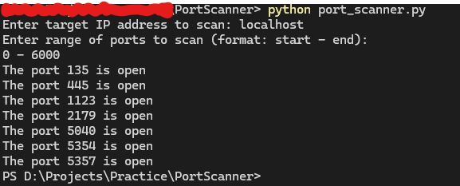

# Targeted Port Scanner with Robust Tool Sets
---
The purpose of this project is to develop a port scanner with precise targeting, and full port scanning capabilities, including the ability to identify open ports in a system, the os and version, available protocols, and vulnerabilities that may be exploited. 
## Currently available Options:
- Ip address targeting
- Port number targeting
- Port range scanning

